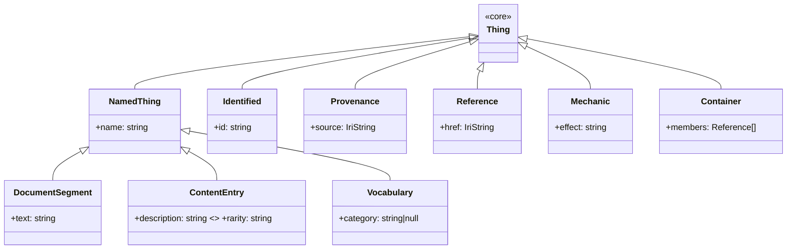
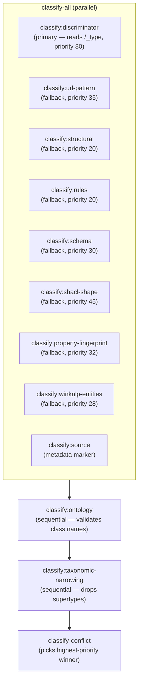

# Architecture

Squashage is a graph reconstitution pipeline built on the native `@studnicky/dagonizer@0.25` engine. A config file is one run. Each run owns two authored DAG documents loaded via `DAGDocument.load` and registered through `dispatcher.registerBundle`: a run-scope DAG and a per-record deep-DAG. The run-scope DAG uses native `scatter { dag }` to fan out one per-record DAG execution per input record, and a native fold node (`squashage:record-fold`) to gather the per-record results. State, services, and a swappable observer flow through the dispatcher.

```text
JSON records → walk-input → fan-out (record DAG) → enrich → finalize → catalog
                              │
                              └─ json-read → classify (8 parallel + 2 sequential)
                                          → conflict → squash → output-provenance
                                          (any failure → record-quarantine → end)
```

Three artifacts land on disk per run:

| File | Contents |
|---|---|
| `<output.path>` | the success graph |
| `<output.path-stem>.prov.<ext>` | PROV-O activity graph (one `prov:Activity` per node) |
| `<outDir>/quarantine/<bucket>/<id>.json` | one file per failed record, grouped by bucket |

## Composition root

`SquashageRun.forRun(...)` is the only constructor. It takes the resolved run config (the root config object, which holds `input`, `output`, and the run knobs directly) and CLI options. In one async call it:

1. Builds the `SquashageServices` bag from the run config and CLI options (logger, AJV, RDF factory + dataset, builder, prefix resolution, IRI namespace, named-graph map, optional ontology, quarantine writer, runStartTime).
2. Wires a `ProvObserver` (or accepts a swap-in observer) bound to `services.dataset`.
3. Instantiates `SquashageDagonizer` with the services bag + observer.
4. Constructs every per-record classifier instance from its config slot; substitutes `NoOpClassifierNode` for every slot that's absent.
5. Loads the authored run-scope and per-record DAG documents via `DAGDocument.load` and registers their node implementations.
6. Bakes the run-level `concurrency` into the native `scatter { dag }` fan-out placement at registration time.
7. Registers both DAG bundles via `dispatcher.registerBundle`.

`run.execute()` returns the dagonizer `Execution<TState>` — both `PromiseLike` (await for the final summary) and `AsyncIterable` (`for await` to observe each node).

## Module map

```text
src/
  SquashageRun.ts              composition root (SquashageRun.forRun)
  cli/dagonizerCli.ts          `squashage-dag build` entry point (--config)
  state/
    SquashageRunState.ts       NodeStateBase + locators[], results[], runStartTime
    SquashageRecordState.ts    NodeStateBase + source, input, proposals{}, classification, squashedQuads
    schemas/                   JSON Schema 2020-12 + FromSchema-derived types
  services/
    SquashageServices.ts       eagerly-built services bag
  observer/
    ProvObserver.ts            writes prov:Activity per node into urn:squashage:prov:<runId>
    ProvObserverInterface.ts   detached observer contract
    NullObserver.ts            no-op for tests
    ProvVocabulary.ts          PROV-O + dag: + xsd term factories
  dispatcher/
    SquashageDagonizer.ts      extends Dagonizer; forwards hooks to ProvObserver
  dag/
    squashage-run.dag.jsonld   authored run-scope DAG (native scatter + record-fold)
    squashage-record.dag.jsonld  authored per-record deep-DAG
    registerRecordNodes.ts     binds per-record node implementations to the dispatcher
    registerRunNodes.ts        binds run-scope node implementations to the dispatcher
  nodes/
    run/                       walkInput, recordScatter, recordFold, enrichEntityLink, rdfjsFinalize, catalogEmit
    record/                    jsonRead, classifyConflict, recordHealthGate, squashNode, outputProvenance, recordQuarantine
    record/classifiers/        Discriminator (primary), Source, UrlPattern, Structural, Rules, Schema, ShaclShape, PropertyFingerprint, WinknlpEntities, Ontology, TaxonomicNarrowing, NoOp
  induction/
    SchemaInducer.ts           accumulates ShapeObservations → draft JSON Schema documents
    RefinementApplier.ts       applies .refine.json DSL (15 ops, deterministic order)
    TaxonomicInheritanceEnricher.ts  materializes ancestor rdf:type quads at build time
    VocabEnricher.ts           vocabulary-class-specific quad enrichment
    ShapeObservation.ts        per-property observation accumulator
    SubjectIriPolicy.ts        policy-resolved subject IRI derivation
  classification/
    PrefixResolver.ts          run → (instance, graph, vocabulary) base IRIs
    predicates/Predicate.ts    compile / evaluate JSON-pointer predicates
    tasks/ShaclShapeClassifier.ts  SHACL machinery, called by the classifier node adapter
  config/                      AJV-validated single-run config + output config
  rdf/                         DataFactory, Dataset, GraphBuilder, Namespaces, Parser, Vocab
  shacl/                       ShaclGate (rdf-validate-shacl wrapper)
  output/                      FileOutput, FormatResolver, OutputReport — used by rdfjs-finalize
  quarantine/                  QuarantineWriter
  ontology/                    JsonTologyOntology + adapters
  errors/                      BaseError + every subclass; every throw is one of these
  modules/logger/              Logger.forComponent
  viz/                         NQuadsGraph, ChunkBuilder, CosmosGraphRenderer (used by `squashage-dag viz`)
  schemas/                     JSON Schema 2020-12 sources (squashage-config, refinement, predicate, output)
  schemas/core/                squashage-core upper ontology (10 classes — Thing through Container)
```

## Run-scope DAG

The diagrams below are emitted by [`scripts/render-dags.ts`](https://github.com/Studnicky/Squashage/blob/main/scripts/render-dags.ts) via `MermaidRenderer.render(dag)` from `@studnicky/dagonizer/viz`. They regenerate on every `docs:build` from the exact DAG documents the dispatcher executes — what you see here is what runs.

<DagDiagram name="squashage-run" caption="Run-scope DAG">

<!--@include: ./architecture/dags/squashage-run.md{7,-2}-->

</DagDiagram>

The run-scope DAG declares a native `scatter { dag }` over the `squashage:record` deep-DAG: the engine spawns one per-record DAG execution per `RecordLocator`, bounded by the run-level `concurrency`. The native fold node `squashage:record-fold` gathers the per-record results into `state.results` as `RecordSummary` entries.

## Per-record DAG (deep-DAG, registered as `squashage:record`)

<DagDiagram name="squashage-record" caption="Per-record DAG">

<!--@include: ./architecture/dags/squashage-record.md{7,-2}-->

</DagDiagram>

<!-- inline reference diagram; the rendered Mermaid above is canonical -->
<details>
<summary>Inline reference</summary>

```mermaid
flowchart TB
  read[json-read]
  parallel{{classify-all parallel collect}}
  ont[classify:ontology]
  narrow[classify:taxonomic-narrowing]
  gate[record-health-gate]
  conflict[classify-conflict]
  squash[squash]
  prov[output-provenance]
  q[record-quarantine]
  END([end])
  read -->|loaded| parallel
  read -->|quarantined| q
  parallel -->|success| ont
  parallel -->|error|   ont
  ont --> narrow
  narrow --> gate
  gate -->|has-proposals| conflict
  gate -->|none|          q
  gate -->|errors|        q
  conflict -->|resolved| squash
  conflict -->|tie|      q
  conflict -->|unknown|  q
  squash -->|squashed| prov
  squash -->|quarantined| q
  prov -->|written| END
  prov -->|skipped| END
  q --> END
```

</details>

## Class lineage

| Base | Subclass | Where |
|---|---|---|
| `Dagonizer` (`@studnicky/dagonizer`) | `SquashageDagonizer` | `src/dispatcher/SquashageDagonizer.ts` |
| `NodeStateBase` (`@studnicky/dagonizer`) | `SquashageRunState`, `SquashageRecordState` | `src/state/` |
| `BaseError` | `OutputConfigError`, `SquashageConfigError`, `FileOutputError`, `ExternalSchemaError`, `QuarantineError`, `ShaclValidationError` | `src/errors/` |
| `ProvObserverInterface` | `ProvObserver`, `NullObserver` | `src/observer/` |

One level of inheritance everywhere. The dispatcher subclass forwards five lifecycle hooks to an injected observer — no other extension mechanism.

## Substrate

| Concern | Substrate | Notes |
|---|---|---|
| Logging | `Logger.forComponent(name)` | every module-level log is component-scoped |
| Errors | `BaseError` subclass | no bare `throw new Error`; every throw carries a code |
| RDF | `@rdfjs/data-model`, `@rdfjs/dataset`, `n3`, `rdf-canonize` | wrapped behind `src/rdf/` |
| SHACL | `rdf-validate-shacl` | wrapped behind `src/shacl/ShaclGate` |
| Schema validation | `ajv` (one instance per run) | lives on `services.ajv` |
| Workflow | `@studnicky/dagonizer@0.25` | native dispatcher (DAGDocument.load + registerBundle, scatter/fold) + state + observer hooks |
| Projection | `@studnicky/json-tology@0.26` | lenient ABox projection of records to RDF quads |

## Determinism

Same run config + same input directory + same node modules ⇒ byte-identical success graph and byte-identical PROV graph (timestamps are sourced from `services.runStartTime`, a single frozen ISO string per run).

The PROV observer uses `Date()` for `prov:startedAtTime` / `prov:endedAtTime` on individual node activities — these vary across runs by design (different wall-clock per execution) but every other quad is content-determined.

---

## Layered taxonomic model

Squashage generalizes across targets through a two-layer schema architecture. No domain-tailored classifier code is needed to add a new target — inheritance and classification are fully config-driven.

### Layer 0 — squashage-core (framework-generic)

Ten classes bundled in `src/schemas/core/` form the reusable upper ontology. Their `$id` base is `https://noocodec.dev/squashage/core/`. Every entity produced by any target is at minimum a `Thing`.



### Layer N — per-target leaf classes

Each target authors leaf schemas that extend one or more core classes via native JSON Schema `allOf + $ref`. The leaf schemas live in the plugin directory alongside the target config.

Example: `aonprd.Feat` extends both `core.ContentEntry` and `core.Mechanic`:

```json
{
  "$id": "https://2e.aonprd.com/Feat",
  "allOf": [
    { "$ref": "https://noocodec.dev/squashage/core/ContentEntry.schema.json" },
    { "$ref": "https://noocodec.dev/squashage/core/Mechanic.schema.json" }
  ]
}
```

The `allOf + $ref` entries are emitted by the `refine` phase when the refinement file specifies `parents`. See [Taxonomy — parents DSL](./usage/taxonomy) for the full field reference.

### Open-world design

A new `_type` value in an incoming record is classified without requiring any enumeration to be updated. The `DiscriminatorClassifierNode` reads the literal string at the configured JSON Pointer and uses it directly as the class name (after optional sanitization). Adding a new class to a target means:

1. Author a leaf schema for the class.
2. Register the schema path in the ontology block.
3. Write a `.refine.json` for the class with the appropriate `parents`.

No code changes. No re-enumeration.

### Multiple inheritance

A leaf class may extend multiple parents. The `allOf` array carries one `$ref` per parent. `TaxonomicInheritanceEnricher` traverses the full ancestor chain and materializes `rdf:type` quads for every ancestor so consumers receive the complete type chain without an OWL reasoner.

---

## Classifier cascade — open-world model

The per-record DAG runs up to 11 classifier nodes. The primary classification path for records that carry a discriminator field is `classify:discriminator`. The enumerative classifiers serve as lower-priority fallbacks.



### `classify:discriminator` — the primary path

**Source:** `src/nodes/record/classifiers/DiscriminatorClassifierNode.ts`

Reads a configured JSON Pointer (default `/_type`) from the record. Uses the resolved string as the `className` proposal. No per-class enumeration required — any value classifies.

Config slot: `classification.discriminator`

```json
{
  "discriminator": {
    "from":     "/_type",
    "sanitize": "pascalCase",
    "priority": 80
  }
}
```

| Field | Type | Default | Description |
|---|---|---|---|
| `from` | string | required | JSON Pointer (RFC 6901) into the record. |
| `fallback` | string | — | Pointer used when `from` resolves to undefined or non-string. |
| `priority` | number | 50 | Proposal priority. |
| `sanitize` | string | `"verbatim"` | `"verbatim"` — use as-is; `"pascalCase"` — split on `[-_\s]+`, capitalize each segment; `"kebabToPascal"` — same as pascalCase. |

When the pointer resolves to a non-empty string, a proposal is emitted with `confidence: 1.0`. When the pointer is absent or resolves to a non-string, the node outputs `no-match`.

### Enumerative classifiers — fallback roles

The enumerative classifiers (`urlPattern`, `structural`, `rules`, `schema`, `shaclShape`, `propertyFingerprint`, `winknlpEntities`) cover:

- Records missing a `_type` field (unstructured dumps).
- Dumps that cannot add a discriminator field to their records.
- Additional confidence signals when `evidence: true` is enabled.

When a discriminator is configured at priority 80 and a urlPattern rule fires at priority 35, `classify-conflict` picks the discriminator proposal — priority wins.

### Conflict resolution

`classify-conflict` runs after `record-health-gate` confirms at least one non-sentinel proposal exists.

1. Filter sentinels (`__source__`, `__validation__`, `__narrowing_applied__`).
2. If all surviving proposals agree on one className — that class wins.
3. If multiple classes propose, find the highest priority. Single winner → it wins. Tie → `onConflict`:
   - `quarantine` — route to `record-quarantine` under bucket `'conflicts'`.
   - `pickPriority` — lexicographically first className wins; `candidates` lists all tied classes.

See [Classifier cascade](./usage/classifier-cascade) for the full sentinel and config reference.

---

## Induction → refine → build pipeline

Squashage models the schema lifecycle as three sequential phases. Each phase is a separate DAG registered on the dispatcher.

```mermaid
flowchart LR
  src[(JSON dump)]
  induce["induce\n(SchemaInducer)"]
  review["author\n.refine.json files"]
  refine["refine\n(RefinementApplier)"]
  build["build\n(ontologyProjectionNode)"]
  graph[(RDF graph)]

  src --> induce --> review --> refine --> build --> graph
```

### Phase 1 — induce

**DAG:** `src/dag/induceDag.ts`  
**Core module:** `src/induction/SchemaInducer.ts`

`induce` walks the dump and accumulates `ShapeObservation` data per classified class. `SchemaInducer.materialize()` produces draft schemas (`*.draft.json`) that are strict-graph-compliant:

- Constrained primitives (enum, min/max, IRI-candidate) are extracted to named sibling schemas under `schemas/inferred/primitives/`.
- Inline nested objects are extracted to named sibling schemas under `schemas/inferred/objects/`.
- Structurally identical shapes share one named schema (deduplication). Distinct shapes with the same semantic name get `_2`, `_3` suffixes (collision avoidance).
- Output is key-sorted and deterministic: same observation set → byte-identical draft on every run.

### Phase 2 — refine

**DAG:** `src/dag/refineDag.ts`  
**Core module:** `src/induction/RefinementApplier.ts`

The operator authors one `.refine.json` per leaf class discovered in the draft output. `RefinementApplier.apply()` processes 15 operations in a fixed, deterministic order:

| # | Operation | What it does |
|---|---|---|
| 1 | `drop` | Remove properties from the schema |
| 2 | `rename` | Rename property keys |
| 3 | `closedEnum` | Mark property as `x-squashage-closed-enum: true` |
| 4 | `openVocabulary` | Remove enum constraints; mark `x-squashage-open-vocab: true` |
| 5 | `promoteIri` | Mark property as IRI reference (`format: 'iri'`, `x-squashage-iri-promotion: true`) |
| 6 | `range` | Attach a range class name to a property (`x-squashage-range`) |
| 7 | `rdfsLabel` | Bind a property to `rdfs:label` |
| 8 | `rdfsComment` | Bind a property to `rdfs:comment` |
| 9 | `subjectIriPolicy` | Override the subject IRI policy for this class |
| 10 | `arrayEnumIri` | Emit IRI-promoted edges for array-of-string enum properties |
| 11 | `skolemSubject` | Mint a skolem IRI for a sub-resource field |
| 12 | `provenanceIri` | Emit a `dct:source` (or other) provenance triple |
| 13 | `predicateOverride` | Replace a field's default predicate IRI |
| 14 | `inverseOf` | Emit inverse edges alongside forward triples |
| 15 | `parents` | Emit `allOf: [{ $ref }]` entries linking to core parent schemas |

Warn-loud, write-anyway semantics: when a rule references a property not found in the draft, a `RefineWarning` is appended and processing continues.

### Phase 3 — build

**DAG:** `src/dag/recordDag.ts` (the standard per-record DAG)  
**Squash node:** `src/nodes/record/ontologyProjection.ts`

`ontologyProjectionNode` is the generic squash node backed by json-tology. It:

1. Resolves the classified class name to a registered schema `$id`. When no schema maps the class, projection falls back to the `Generic` class so the record is still projected.
2. Calls `services.ontology.toQuads(schema.$id, record)` — json-tology projects the record to RDF quads per the schema.
3. Rebinds the minted subject to the policy-resolved IRI (`SubjectIriPolicy`).
4. Rebinds every quad's graph to `services.graphs['default']`.
5. Calls `TaxonomicInheritanceEnricher.enrich()` to append ancestor `rdf:type` quads.
6. Calls `VocabEnricher.enrich()` for vocabulary-class-specific enrichment.
7. Writes all quads to `state.squashedQuads` and `services.dataset`.

**Lenient projection:** the json-tology ABox projection is lenient — a record that does not match its schema's shape is projected on a best-effort basis rather than dropped. No record is discarded on shape mismatch, and unmapped classes resolve to the `Generic` fallback class.

**Streaming serialization:** with `output.mode: 'stream'`, `rdfjs-finalize` streams per-record projected ABox and PROV quads directly to disk via an async-iterable execution over the dataset. Memory stays bounded regardless of corpus size.

**CURIE expansion:** the wrapper post-processes `toQuads()` output to expand any compact CURIEs (e.g. `rdf:type`) that json-tology emits — only fully-resolved IRI terms reach the dataset.

---

## Onboarding a new dump

A complete recipe for adding a new domain dump to Squashage. A config file is one run.

### Step 1 — configure

Create `plugins/<name>/<name>.config.json`. The root object holds `input`, `output`, and the run knobs directly. The minimum shape:

```jsonc
{
  "input":  { "basePath": "./output/<name>", "format": "json" },
  "output": { "type": "file", "path": "./graphs/<name>.nq", "format": "nquads", "mode": "stream" },
  "concurrency": 8,
  "graphs": { "default": "https://<name>.example.org/graph/default" },
  "ontology": {
    "baseIri": "https://<name>.example.org/",
    "schemas": []
  },
  "classification": {
    "conflict":      { "onConflict": "pickPriority", "evidence": true },
    "discriminator": { "from": "/_type", "sanitize": "pascalCase", "priority": 80 }
  }
}
```

### Step 2 — induce

Run the inducer against the dump to discover classes and generate draft schemas:

```bash
squashage-dag induce --config plugins/<name>/<name>.config.json
```

This writes `plugins/<name>/schemas/inferred/` with one `*.draft.json` per discovered class plus extracted primitive and object schemas.

### Step 3 — author refinements

Review the draft schemas. For each discovered class, create `plugins/<name>/schemas/refinements/<ClassName>.refine.json`:

```json
{
  "$schema": "https://squashage.dev/schemas/refinement.schema.json",
  "appliesTo": "Feat",
  "rdfsLabel":   "name",
  "rdfsComment": "description_text",
  "promoteIri":  ["/url"],
  "closedEnum":  ["rarity"],
  "range":       { "rarity": "Rarity" },
  "drop":        ["/raw_fields", "/trait_ids"],
  "subjectIriPolicy": { "from": "/url", "sanitize": "url-tail", "fallback": "/name" },
  "arrayEnumIri": { "traits": "Trait" },
  "provenanceIri": { "predicate": "dct:source", "from": "/url" },
  "parents":    ["ContentEntry", "Mechanic"],
  "parentsBase": "https://noocodec.dev/squashage/core"
}
```

Choose `parents` from the core inventory based on what the class represents:

| If the class is... | Extend |
|---|---|
| A catalog entry with name, description, rarity | `ContentEntry` |
| A rules-bearing structure with effect text | `Mechanic` |
| An entry with both catalog metadata and rules text | `ContentEntry`, `Mechanic` |
| A closed-vocabulary term (trait, action cost) | `Vocabulary` |
| Structured prose text (rule sections, chapters) | `DocumentSegment` |
| A collection (monster families, feature lists) | `Container` |
| An entity with a stable internal ID | `Identified` |
| Anything else | `Thing` or `NamedThing` |

### Step 4 — refine

Apply the refinements to materialize final schemas:

```bash
squashage-dag refine --config plugins/<name>/<name>.config.json
```

Final schemas land in `plugins/<name>/schemas/`. Register each schema path in the `ontology.schemas` array of the run config.

### Step 5 — build

Project the dump into the graph:

```bash
squashage-dag build --config plugins/<name>/<name>.config.json
```

The output lands at the path specified in `output.path`.

---

## AONPRD — production state

AONPRD (Archives of Nethys, Pathfinder 2nd Edition) is the primary production target and the reference implementation for the layered model.

| Metric | Value |
|---|---|
| Records | 13,572 |
| Success rate | 100% |
| Leaf classes | 18 (17 with core inheritance + `Unknown`) |
| Success quads | ~578k |
| Ontology quads (TBox + SHACL) | ~14k |
| Avg quads per record | ~42 |

### AONPRD leaf class inheritance table

| aonprd class | core parents | Notes |
|---|---|---|
| `Action` | `ContentEntry`, `Mechanic` | Game actions with effect text |
| `Ancestry` | `ContentEntry` | Playable ancestries |
| `Armor` | `ContentEntry` | Armor items |
| `Background` | `ContentEntry` | Character backgrounds |
| `Class` | `ContentEntry`, `Container` | Character classes (aggregates features) |
| `Condition` | `ContentEntry`, `Mechanic` | Status conditions with mechanical effects |
| `Equipment` | `ContentEntry` | General equipment items |
| `Feat` | `ContentEntry`, `Mechanic` | Character feats with prerequisites and effect text |
| `Generic` | `ContentEntry` | Catch-all for catalog entries without a dedicated type |
| `Hazard` | `ContentEntry`, `Mechanic` | Environmental hazards |
| `Monster` | `ContentEntry` | Bestiary monsters |
| `MonsterFamily` | `Container` | Monster family groupings (members → monster IRIs) |
| `Rule` | `ContentEntry`, `DocumentSegment` | Core rulebook sections and rule entries |
| `Shield` | `ContentEntry` | Shield items |
| `Spell` | `ContentEntry`, `Mechanic` | Spells with effect text |
| `Trait` | `Vocabulary` | Closed-vocabulary classification tags |
| `Weapon` | `ContentEntry` | Weapon items |
| `Unknown` | — | Fallback for records with unrecognized `_type`; no core inheritance |

The `Rule` class needs zero classifier changes: the discriminator reads `_type: "rule"`, sanitizes it to `Rule`, and resolves to `Rule.schema.json` automatically.

### AONPRD config excerpt

```json
{
  "classification": {
    "conflict":      { "onConflict": "pickPriority", "evidence": true },
    "discriminator": { "from": "/_type", "sanitize": "pascalCase", "priority": 80 },
    "urlPattern": {
      "patterns": [
        { "className": "Feat",  "match": "/Feats\\.aspx",  "priority": 35 },
        { "className": "Spell", "match": "/Spells\\.aspx", "priority": 35 }
      ]
    }
  }
}
```

URL-pattern and structural classifiers remain configured as lower-priority fallbacks for records missing `_type`.

---

## Known limitations

### json-tology issue #126 — cross-schema `$ref` drops nested object properties

Cross-schema `$ref` resolution in json-tology's ABox projection currently drops properties from nested (extracted) object schemas. This is why the average quad density is ~42 quads/record rather than the theoretical full projection. Properties defined directly on the leaf schema are projected correctly; properties on linked sibling schemas are not.

Tracked upstream: [https://github.com/Studnicky/json-tology/issues/126](https://github.com/Studnicky/json-tology/issues/126)

Quad density will recover automatically when the upstream fix ships. No squashage-side changes are needed.

---

## See also

- [Taxonomy — upper ontology and parents DSL](./usage/taxonomy)
- [Classifier cascade](./usage/classifier-cascade)
- [Configuration](./usage/configuration)
- [DAG](./usage/pipeline)
