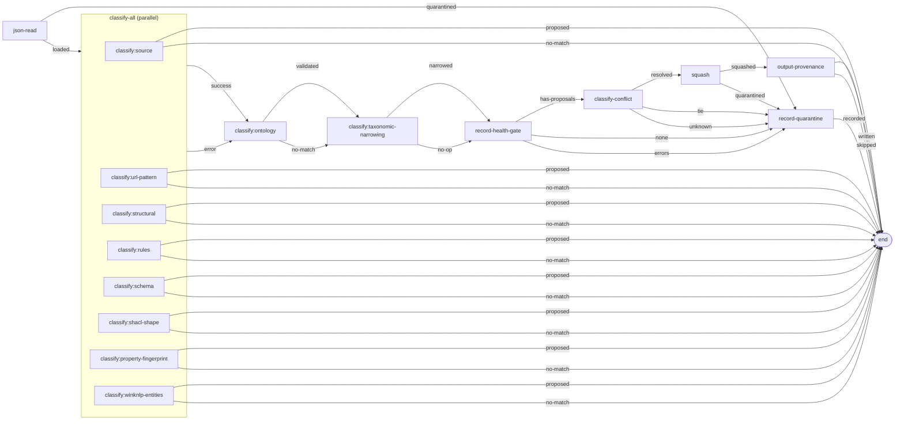

# Per-record DAG (squashage:record)

```mermaid
flowchart LR
  %% squashage:record (v1.0)
  json-read
  json-read[json-read]
  json-read -->|loaded| classify-all
  json-read -->|quarantined| record-quarantine
  subgraph classify-all["classify-all (parallel)"]
    classify:source[classify:source]
    classify:url-pattern[classify:url-pattern]
    classify:structural[classify:structural]
    classify:rules[classify:rules]
    classify:schema[classify:schema]
    classify:shacl-shape[classify:shacl-shape]
    classify:property-fingerprint[classify:property-fingerprint]
    classify:winknlp-entities[classify:winknlp-entities]
  end
  classify-all -->|success| classify:ontology
  classify-all -->|error| classify:ontology
  classify:source[classify:source]
  classify:source -->|proposed| END
  classify:source -->|no-match| END
  classify:url-pattern[classify:url-pattern]
  classify:url-pattern -->|proposed| END
  classify:url-pattern -->|no-match| END
  classify:structural[classify:structural]
  classify:structural -->|proposed| END
  classify:structural -->|no-match| END
  classify:rules[classify:rules]
  classify:rules -->|proposed| END
  classify:rules -->|no-match| END
  classify:schema[classify:schema]
  classify:schema -->|proposed| END
  classify:schema -->|no-match| END
  classify:shacl-shape[classify:shacl-shape]
  classify:shacl-shape -->|proposed| END
  classify:shacl-shape -->|no-match| END
  classify:property-fingerprint[classify:property-fingerprint]
  classify:property-fingerprint -->|proposed| END
  classify:property-fingerprint -->|no-match| END
  classify:winknlp-entities[classify:winknlp-entities]
  classify:winknlp-entities -->|proposed| END
  classify:winknlp-entities -->|no-match| END
  classify:ontology[classify:ontology]
  classify:ontology -->|validated| classify:taxonomic-narrowing
  classify:ontology -->|no-match| classify:taxonomic-narrowing
  classify:taxonomic-narrowing[classify:taxonomic-narrowing]
  classify:taxonomic-narrowing -->|narrowed| record-health-gate
  classify:taxonomic-narrowing -->|no-op| record-health-gate
  record-health-gate[record-health-gate]
  record-health-gate -->|has-proposals| classify-conflict
  record-health-gate -->|none| record-quarantine
  record-health-gate -->|errors| record-quarantine
  classify-conflict[classify-conflict]
  classify-conflict -->|resolved| squash
  classify-conflict -->|tie| record-quarantine
  classify-conflict -->|unknown| record-quarantine
  squash[squash]
  squash -->|squashed| output-provenance
  squash -->|quarantined| record-quarantine
  output-provenance[output-provenance]
  output-provenance -->|written| END
  output-provenance -->|skipped| END
  record-quarantine[record-quarantine]
  record-quarantine -->|recorded| END
  END([end])
```
