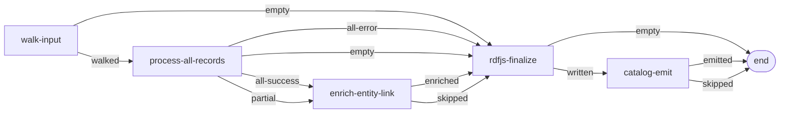

# Run-scope DAG (squashage:run)

```mermaid
flowchart LR
  %% squashage:run (v1.0)
  walk-input
  walk-input[walk-input]
  walk-input -->|walked| process-all-records
  walk-input -->|empty| rdfjs-finalize
  process-all-records[process-all-records]
  process-all-records -->|all-success| enrich-entity-link
  process-all-records -->|partial| enrich-entity-link
  process-all-records -->|all-error| rdfjs-finalize
  process-all-records -->|empty| rdfjs-finalize
  enrich-entity-link[enrich-entity-link]
  enrich-entity-link -->|enriched| rdfjs-finalize
  enrich-entity-link -->|skipped| rdfjs-finalize
  rdfjs-finalize[rdfjs-finalize]
  rdfjs-finalize -->|written| catalog-emit
  rdfjs-finalize -->|empty| END
  catalog-emit[catalog-emit]
  catalog-emit -->|emitted| END
  catalog-emit -->|skipped| END
  END([end])
```
