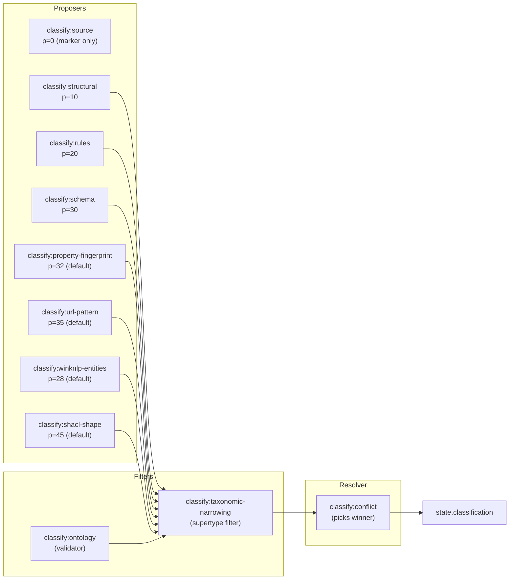

# Classifier cascade

Eleven tasks. You list the ones you want in `pipeline:` and supply a matching top-level config namespace. That's the whole opt-in.

List none and you get no classifier. List two or more `proposesClass: true` tasks and you must list `classify:conflict` after them, or the orchestrator throws at startup. Each plugin is a self-registering silo module: it installs its own `onRunStart` hook that validates config and compiles startup state, and a per-record task that reads from the pre-compiled cache. No central factory mediates between them.

The cascade is purely deterministic. Same config + same record = same classification, same quarantine, same exit code. No probabilistic models, no random seeds, no network calls.

## Silo-driven architecture

Each classifier is a self-registering plugin. When the module loads, it calls:

```ts
TaskRegistry.register('classify:<name>', perRecordTask, { proposesClass: true | false });
TaskRegistry.registerHook('classify:<name>', 'onRunStart', startupHook, manifest);
```

The `onRunStart` hook runs once per target before any record flows. It reads `ctx.config[<namespace>]`, validates via `ctx.ajv.compile(<pluginConfigSchema>)`, compiles predicates/regexes/schemas/fingerprints into a module-private cache keyed by `ctx.target`, and fails fast with `OutputConfigError` if the config is invalid. The per-record task reads from the cache and produces `ClassificationProposalInterface` objects, appending them onto `state.classifications`.

`classify:conflict` consumes the full `state.classifications` array and writes `state.classification`. The orchestrator counts how many registered tasks have `proposesClass: true` and asserts `classify:conflict` is registered when that count is two or more.

For the full plugin coordination protocol, see [Context silo](../context-silo).

## Priority cascade

Higher number wins. When two proposals share the same priority and disagree on class, `classify:conflict` applies `onConflict` policy.

```
classify:structural           priority 10  (configurable)
classify:rules                priority 20  (configurable)
classify:schema               priority 30  (configurable)
classify:property-fingerprint priority 32  (default; configurable)
classify:url-pattern          priority 35  (default; configurable)
classify:winknlp-entities     priority 28  (default; configurable)
classify:shacl-shape          priority 45  (default; configurable)
classify:ontology             (validator; does not propose a class)
classify:taxonomic-narrowing  (post-proposer filter; does not propose a class)
classify:conflict             (resolver; reads all proposals, writes winner)
```



## Task menu

| Task | `proposesClass` | Config namespace | Default priority |
|------|-----------------|-----------------|-----------------|
| `classify:source` | false (marker) | `source: true` | 0 |
| `classify:structural` | true | `structural: []` | 10 |
| `classify:rules` | true | `rules: []` | 20 |
| `classify:schema` | true | `schemas: []` | 30 |
| `classify:property-fingerprint` | true | `propertyFingerprint: {}` | 32 |
| `classify:url-pattern` | true | `urlPattern: {}` | 35 |
| `classify:winknlp-entities` | true | `winknlpEntities: {}` | 28 |
| `classify:shacl-shape` | true | `shaclShape: {}` | 45 |
| `classify:ontology` | false (validator) | `ontologyClassifier: {}` | — |
| `classify:taxonomic-narrowing` | false (filter) | `taxonomicNarrowing: {}` | — |
| `classify:conflict` | false (resolver) | `conflict: {}` | — |

**Proposal accumulation flow**: Each proposing task (source, structural, rules, schema, url-pattern, property-fingerprint, winknlp-entities, shacl-shape) appends to `state.classifications` independently. A single record can accumulate many proposals if multiple classifiers match. Taxonomic narrowing filters out supertype proposals. The conflict resolver then examines all of them, filters metadata sentinels like `__source__` and `__narrowing_applied__`, and picks one winner by priority (highest first) and className (lex asc as tiebreak). If two proposals tie on priority and disagree on class, `onConflict: 'quarantine'` writes the record to quarantine with both candidates preserved; `onConflict: 'pickPriority'` deterministically picks the lexicographically first className.

---

## classify:source

Reads the `_source` block from the record. If `_source` is present and valid, emits a `__source__` marker proposal at priority 0. Does not propose a class; just marks the record as traceable.

Config namespace: `source: true`. No other options.

What it emits:
```json
{ "source": "classify:source", "className": "__source__", "priority": 0, "confidence": 1, "reasons": ["_source present"] }
```

---

## classify:structural

Closed-vocab predicate rules evaluated against the record. Each rule has one predicate expression and emits at most one proposal.

```json
"structural": [
  {
    "className": "feat",
    "priority":  10,
    "predicate": { "path": "/_type", "equals": "feat" },
    "reasons":   ["_type=feat (structural)"]
  }
]
```

When to use: the record has a single discriminator field whose value unambiguously identifies the class.

---

## classify:rules

Same rule shape as structural, but the predicate can compose multiple conditions. Use `all`, `any`, `not` to build decision tables.

```json
"rules": [
  {
    "className": "feat",
    "priority":  20,
    "predicate": {
      "all": [
        { "path": "/_type", "equals": "feat" },
        { "path": "/level", "type": "number" },
        { "path": "/rarity", "in": ["common", "uncommon", "rare"] }
      ]
    },
    "reasons": ["_type=feat", "level present", "rarity valid"]
  }
]
```

Priority 20 is higher than structural's 10; so if both fire, the rules proposal wins.

---

## classify:schema

Runs the record through an ordered list of pre-compiled AJV validators. First match wins. Schema files are loaded and compiled once at startup via the run-wide shared AJV instance from `context:ajv`.

```json
"schemas": [
  { "className": "feat",  "priority": 30, "schemaPath": "./schemas/feat.schema.json" },
  { "className": "spell", "priority": 30, "schemaPath": "./schemas/spell.schema.json" }
]
```

`schemaPath` is resolved relative to the config file. Standard JSON Schema Draft-07 format.

---

## classify:ontology

Validates that every proposed class name has an entry in the ontology map. Proposals with unknown class names are annotated with a `__validation__` sentinel.

Config namespace is `ontologyClassifier` (not `ontology` — that key is reserved for `targets.<id>.ontology.engine`):

```json
"ontologyClassifier": {
  "classes": {
    "feat":  "https://squashage.dev/vocabulary/aonprd#Feat",
    "spell": "https://squashage.dev/vocabulary/aonprd#Spell"
  }
}
```

---

## classify:conflict

Picks the winner from all accumulated proposals.

```json
"conflict": {
  "onConflict": "quarantine",
  "onUnknown":  "quarantine",
  "evidence":   true
}
```

Resolution order:
1. `__source__` and `__narrowing_applied__` sentinels are filtered out.
2. Remaining proposals sorted: `priority` descending, then `className` lexicographic ascending as tiebreak.
3. If the top two proposals share the same priority → conflict. `onConflict` decides: `quarantine` writes the record to `quarantine/conflicts/<id>.json`; `pickPriority` takes the first one alphabetically.
4. If no proposals survive → unknown. `onUnknown` decides: `quarantine` writes to `quarantine/unknown/<id>.json`; `skip` drops the record.
5. Winner is written to `state.classification`.

Quarantine is graceful. The build doesn't fail when records land there; exit code stays `0`. Check `graphs/<target>/quarantine/` after a build.

**Edge cases**: If structural proposes `feat` at priority 10 and rules proposes `feat` at priority 20, both for the same record, conflict resolution sees one className (feat) with two distinct priorities. The higher-priority rules proposal wins; the structural proposal is superseded, not a conflict. A true conflict happens when structural and rules both fire for different classes at the same priority: `feat` at 20 and `spell` at 20. Then `onConflict` decides whether to quarantine or pick the lexicographically first one (spell).

---

## classify:url-pattern

See [URL-pattern classifier](./url-pattern-classifier) for full documentation. Summary: evaluates pre-compiled regexes against the record's URL field and emits one proposal per matching pattern. Default priority 35. Config namespace: `urlPattern`.

---

## classify:property-fingerprint

See [Property-fingerprint classifier](./property-fingerprint-classifier) for full documentation. Summary: computes Jaccard similarity between the record's property key set and pre-loaded class fingerprints. Default priority 32. Config namespace: `propertyFingerprint`.

---

## classify:winknlp-entities

See [winkNLP entities classifier](./winknlp-entities) for full documentation. Summary: runs deterministic pattern-based NER on configured prose fields using winkNLP custom entities. Default priority 28. Config namespace: `winknlpEntities`.

---

## classify:shacl-shape

See [SHACL-shape classifier](./shacl-shape-classifier) for full documentation. Summary: validates each record's projected ABox against SHACL NodeShapes. Default priority 45. Config namespace: `shaclShape`.

---

## classify:taxonomic-narrowing

See [Taxonomic narrowing](./taxonomic-narrowing) for full documentation. Summary: collapses supertype proposals when a more-specific subtype is also present, using the OWL `subClassOf` transitive closure from the configured TBox. Config namespace: `taxonomicNarrowing`. Place after all proposers, before `classify:conflict`.

---

## Predicate language

All structural and rules predicates use JSON Pointer paths (RFC 6901) and a closed operator set defined in `src/schemas/predicate.schema.json`.

Paths:
- `/field`: top-level field
- `/nested/field`: nested
- `/array/0`: array index
- `~1` escapes `/`, `~0` escapes `~`
- Empty pointer `""` is rejected

### Operators

| Operator | Shape | Notes |
|----------|-------|-------|
| `equals` | `{ path, equals: value }` | Deep structural equality. |
| `notEquals` | `{ path, notEquals: value }` | Inverse of equals. |
| `in` | `{ path, in: [value, ...] }` | Value must be in the array. |
| `notIn` | `{ path, notIn: [value, ...] }` | Value must not be in the array. |
| `exists` | `{ path, exists: true }` | Path must resolve to a non-null value. |
| `missing` | `{ path, missing: true }` | Path must not resolve (or resolve to null). |
| `type` | `{ path, type: 'string'\|'number'\|'boolean'\|'object'\|'array'\|'null' }` | JSON type check. |
| `regex` | `{ path, regex: '^...$' }` | Anchors required. No flags. |
| `length` | `{ path, length: { gte?, lte?, eq? } }` | String or array length. |
| `range` | `{ path, range: { gte?, lte?, gt?, lt? } }` | Finite number comparison. |
| `all` | `{ all: [Predicate, ...] }` | All must match. |
| `any` | `{ any: [Predicate, ...] }` | At least one must match. |
| `not` | `{ not: Predicate }` | Invert. |

### Worked examples

One predicate per operator:

```jsonc
// equals; exact value match
{ "path": "/_type", "equals": "feat" }

// notEquals; exclude a value
{ "path": "/_type", "notEquals": "spell" }

// in; set membership
{ "path": "/rarity", "in": ["common", "uncommon"] }

// notIn; set exclusion
{ "path": "/rarity", "notIn": ["rare", "unique"] }

// exists; field present and non-null
{ "path": "/level", "exists": true }

// missing; field absent or null
{ "path": "/deprecated", "missing": true }

// type; JSON type
{ "path": "/level", "type": "number" }

// regex; pattern match (anchors required)
{ "path": "/url", "regex": "^https://2e\\.aonprd\\.com/Feats\\.aspx" }

// length; string or array length bounds
{ "path": "/traits", "length": { "gte": 1 } }

// range; numeric range
{ "path": "/level", "range": { "gte": 1, "lte": 20 } }

// all; conjunction
{ "all": [
    { "path": "/_type", "equals": "feat" },
    { "path": "/level", "type": "number" },
    { "path": "/rarity", "exists": true }
] }

// any; disjunction
{ "any": [
    { "path": "/_type", "equals": "feat" },
    { "path": "/_type", "equals": "archetype" }
] }

// not; negation
{ "not": { "path": "/_type", "equals": "spell" } }
```

Composition works to arbitrary depth:

```json
{
  "all": [
    { "path": "/_type", "equals": "feat" },
    { "any": [
        { "path": "/level", "range": { "gte": 1, "lte": 10 } },
        { "path": "/traits", "in": ["legendary"] }
    ]},
    { "not": { "path": "/deprecated", "exists": true } }
  ]
}
```

Predicates are compiled once at config load. Runtime evaluation is a single switch over the AST; no interpretation overhead per record.

---

## Related

- [Configuration](./configuration); how to wire classifiers in the config
- [Pipeline](./pipeline); where classification fits in the task queue
- [Plugins](./plugins); how to author a self-registering pipeline plugin
- [Context silo](../context-silo); the plugin coordination contract
