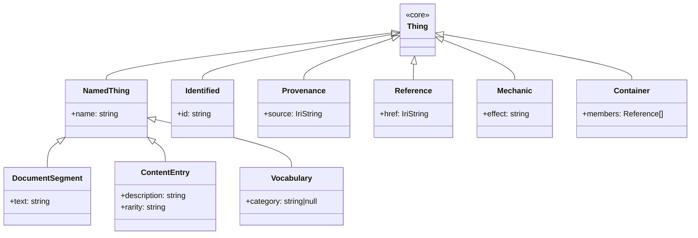

# Taxonomy — upper ontology and parents DSL

Squashage ships a small, reusable upper ontology called **squashage-core**. Every target builds its domain-specific leaf classes by extending these 10 generic classes. Inheritance is expressed with native JSON Schema `allOf + $ref`, not a custom keyword. The framework materializes transitive ancestor `rdf:type` triples at build time so downstream consumers do not need OWL reasoning.

## The squashage-core upper ontology

All 10 classes live in `src/schemas/core/`. Their `$id` base is `https://noocodec.dev/squashage/core/`.

### Class inventory

| Class | Parent | Key property | Semantic binding | Description |
|---|---|---|---|---|
| `Thing` | — | — | — | Root; every entity is at minimum a Thing |
| `NamedThing` | Thing | `name: string` | `name → rdfs:label` | A Thing with a human-readable name |
| `Identified` | Thing | `id: string` | — | Carries a stable identifier independent of the subject IRI |
| `Provenance` | Thing | `source: IriString` | `source → dct:source` | Mixin for dct:source tracking |
| `DocumentSegment` | NamedThing | `text: string` | — | Structured prose (chapter pages, rules text) |
| `ContentEntry` | NamedThing | `description`, `rarity` | — | Canonical superclass for catalog-style records |
| `Vocabulary` | NamedThing | `category: string\|null` | — | Closed-vocabulary term (traits, rarities, action costs) |
| `Reference` | Thing | `href: IriString` | — | IRI-promoted cross-reference between entities |
| `Mechanic` | Thing | `effect: string` | — | Rules-text-bearing structure |
| `Container` | Thing | `members: Reference[]` | — | Collection holding References to member entities |

### Inheritance diagram



### Schema locations

Each class is a standalone JSON Schema 2020-12 document:

| Class | Schema file |
|---|---|
| `Thing` | `src/schemas/core/Thing.schema.json` |
| `NamedThing` | `src/schemas/core/NamedThing.schema.json` |
| `Identified` | `src/schemas/core/Identified.schema.json` |
| `Provenance` | `src/schemas/core/Provenance.schema.json` |
| `DocumentSegment` | `src/schemas/core/DocumentSegment.schema.json` |
| `ContentEntry` | `src/schemas/core/ContentEntry.schema.json` |
| `Vocabulary` | `src/schemas/core/Vocabulary.schema.json` |
| `Reference` | `src/schemas/core/Reference.schema.json` |
| `Mechanic` | `src/schemas/core/Mechanic.schema.json` |
| `Container` | `src/schemas/core/Container.schema.json` |

---

## The `parents` refinement DSL

The refinement DSL (schema: `src/schemas/refinement.schema.json`) is applied to draft schemas during the `refine` phase. The `parents` field is operation #15 — the final operation applied by `RefinementApplier.apply()`.

### Field reference

```json
{
  "$schema": "https://squashage.dev/schemas/refinement.schema.json",
  "appliesTo": "Feat",
  "parents": ["ContentEntry", "Mechanic"],
  "parentsBase": "https://noocodec.dev/squashage/core"
}
```

| Field | Type | Required | Description |
|---|---|---|---|
| `parents` | `string[]` | no | Class names to extend. Each becomes one `allOf: [{ $ref }]` entry. |
| `parentsBase` | `string` | no | Base URL for `$ref` construction. When absent, derived from the draft's `$id` by stripping the `/inferred/<leaf>` suffix. |

### How `$ref` paths are constructed

For each entry in `parents`, the applier builds:

```
<parentsBase>/<ClassName>.schema.json
```

Example: `parents: ["ContentEntry"]` with `parentsBase: "https://noocodec.dev/squashage/core"` emits:

```json
{ "$ref": "https://noocodec.dev/squashage/core/ContentEntry.schema.json" }
```

### Additive merge with existing `allOf`

`parents` entries are appended to any `allOf` array already present in the draft schema — they do not overwrite it. Drafts produced by `SchemaInducer` do not carry `allOf`, so the merge is a no-op in practice. If a draft does carry existing `allOf` entries (e.g. from a hand-authored seed), they are preserved and the parent refs are appended after them.

### Multiple inheritance

A class may extend multiple parents. List them all; order is preserved in the output `allOf` array and in the ancestor traversal order used by `TaxonomicInheritanceEnricher`:

```json
{
  "parents": ["ContentEntry", "Mechanic"],
  "parentsBase": "https://noocodec.dev/squashage/core"
}
```

This produces:

```json
{
  "allOf": [
    { "$ref": "https://noocodec.dev/squashage/core/ContentEntry.schema.json" },
    { "$ref": "https://noocodec.dev/squashage/core/Mechanic.schema.json" }
  ]
}
```

### `parentsBase` derivation

When `parentsBase` is absent the applier derives it from the draft's `$id`:

1. Parse the `$id` URL.
2. Take the pathname directory (everything before the last `/`).
3. Strip a trailing `/inferred` segment if present — drafts live in `<origin>/schemas/inferred/`, finals live in `<origin>/schemas/`.
4. Reconstruct `origin + derived path` (no trailing slash).

Example derivation:

```
$id  = "https://2e.aonprd.com/schemas/inferred/Feat.draft.json"
dir  = /schemas/inferred   →  strip /inferred  →  /schemas
base = "https://2e.aonprd.com/schemas"
ref  = "https://2e.aonprd.com/schemas/ContentEntry.schema.json"
```

This is only useful when the parent schemas live beside the leaf schemas (same origin, same schema directory). When extending squashage-core, always specify `parentsBase` explicitly.

### Name validation

Each parent name must match `[A-Za-z][A-Za-z0-9_]*`. Invalid names (empty string, names with hyphens, etc.) emit a `PARENTS_INVALID_NAME` warning and are skipped. The rest of the `parents` list continues to apply.

---

## TaxonomicInheritanceEnricher

**Source:** `src/induction/TaxonomicInheritanceEnricher.ts`

The enricher is a pure, stateless class called from `ontologyProjection` after the `VocabEnricher` pass. It adds ancestor `rdf:type` quads for every subject that has already received its direct class type quad.

### Why it exists

OWL semantics entail that if `aonprd:Feat rdfs:subClassOf core:ContentEntry`, every Feat instance is also a ContentEntry. Most consumers — SPARQL endpoints, graph stores, the visualization layer — do not run OWL reasoning. The enricher materializes those entailed triples explicitly so consumers get the full type chain without a reasoner.

### What it emits

For a Feat record with subject `https://2e.aonprd.com/PowerAttack`, given ancestors `[core:ContentEntry, core:NamedThing, core:Thing]`, it appends:

```turtle
<https://2e.aonprd.com/PowerAttack>  rdf:type  <https://noocodec.dev/squashage/core/ContentEntry>  <graph> .
<https://2e.aonprd.com/PowerAttack>  rdf:type  <https://noocodec.dev/squashage/core/NamedThing>    <graph> .
<https://2e.aonprd.com/PowerAttack>  rdf:type  <https://noocodec.dev/squashage/core/Thing>         <graph> .
```

Deduplication is enforced: quads already present in `baseQuads` are not emitted again. Iteration order mirrors `ancestorIris` exactly — the caller (`JsonTologyOntology.ancestorIris`) supplies BFS order (immediate parent first, root last).

### Signature

```ts
static enrich(
  baseQuads:    ReadonlyArray<Quad>,
  className:    string,
  ancestorIris: ReadonlyArray<string>,
  subjectIri:   string,
  factory:      DataFactory,
  targetGraph:  NamedNode | DefaultGraph,
): ReadonlyArray<Quad>
```

Returns a new array — never mutates the input.

---

## See also

- [Architecture — layered taxonomic model](../architecture#layered-taxonomic-model) — Layer 0 / Layer N split and open-world design.
- [Classifier cascade](./classifier-cascade) — how `classify:discriminator` reads `_type` to resolve the class name.
- [Configuration](./configuration) — `classification.discriminator` config slot.
- [Ontology (json-tology)](./ontology) — how `services.ontology` traverses the schema graph for ancestor resolution.
